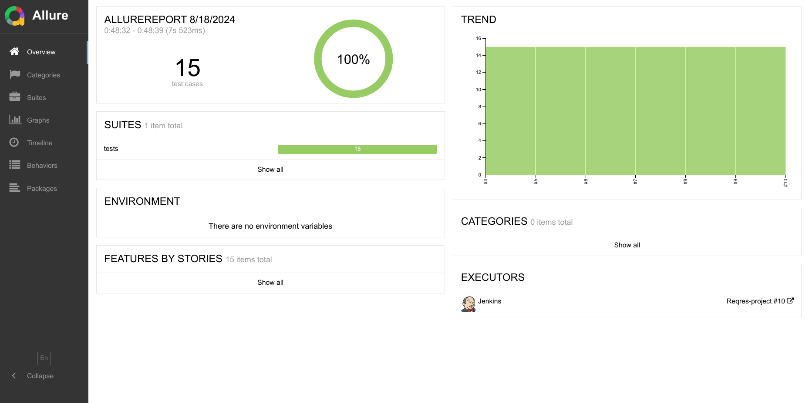
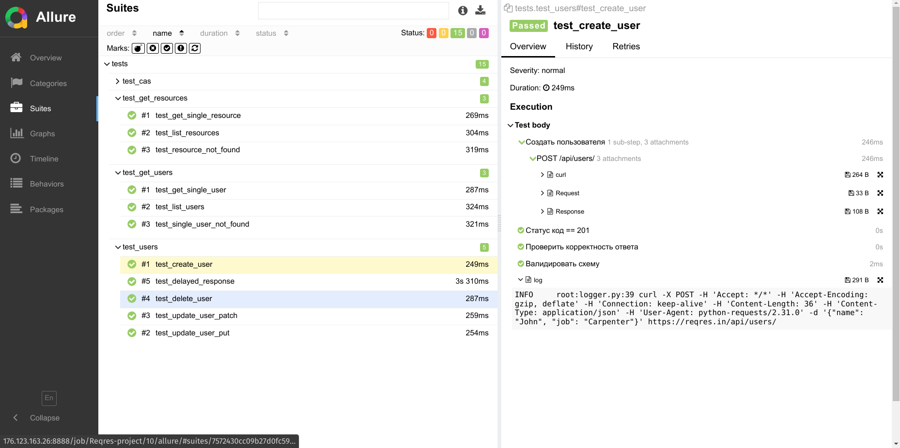

<h1 align="center">Проект API тестов <a href="https://reqres.in">reqres.in</a></h1>

<h3 align="center">Python | Pytest | Requests | Jenkins | Allure | Telegram</h3>
<h3 align="center">
      &nbsp;&nbsp;&nbsp;&nbsp;
      &nbsp;&nbsp;&nbsp;&nbsp;
      &nbsp;&nbsp;&nbsp;&nbsp;
     &nbsp;&nbsp;&nbsp;&nbsp;
      &nbsp;&nbsp;&nbsp;&nbsp;

</h3>

---

> <a target="_blank" href="http://176.123.163.26:8888/job/Reqres-project/">Ссылка на проект в мой Jenkins: доступны прогоны и allure отчёты</a>

Проект содержит шаги для allure отчётов. К отчёту прикладываются `http` запрос и его `curl` версия, `http` ответ, лог.

### Реализованы тесты:
#### API
Регистрация
- [x] Успешная регистрация пользователя
- [x] Регистрация без поля пароля
- [x] Регистрация без поля логина
- [x] Регистрация без тела запроса

Логин
- [x] Успешный логин пользователя
- [x] Неуспешный логин пользователя
- [x] Логин без поля пароля
- [x] Логин без поля логина
- [x] Логин без тела запроса
- [x] Логин с неверным email

Пользователи
- [x] Создание пользователя
- [x] Обновление пользователя
- [x] Удаление пользователя

- [x] Получение списка пользователей
- [x] Получение информации об одном пользователе
- [x] Пользователь не найден

- [x] Получение информации о ресурсе
- [x] Получение информации о списке ресурсов
- [x] Ресурс не найден

- [x] Ответ с задержкой


## Запуск тестов

### Локально

1. Клонировать репозиторий 
```bash
git clone https://github.com/vinterbris/qa_guru_python_9_24.git
```
2. В терминале в директории проекта создать и активировать виртуальное окружение
```bash
python -m venv .venv 
source .venv/bin/activate 
```
3. Установить зависимости
```
pip install -r requirements.txt 
```
4. Запустить командой
```bash
pytest
```

#### Получение отчета allure
```bash
allure serve
```

## Пример отчёта





## Оповещения в мессенджер

> _Настроена отправка оповещений в телеграм канал. Возможна настройка для Email,Slack, Discord, Skype, Mattermost, Rocket.Chat_

