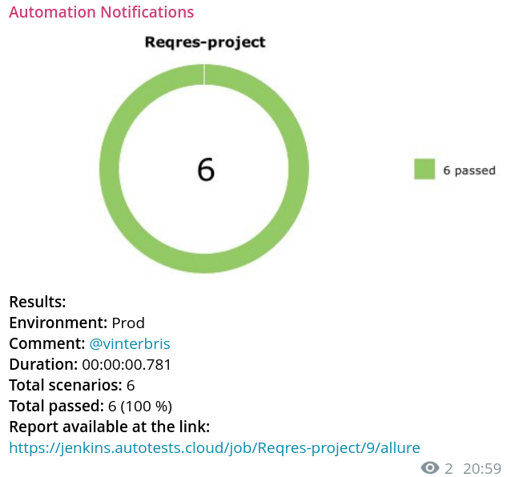

<h1 align="center">Проект API тестов <a href="https://reqres.in">reqres.in</a></h1>

<h3 align="center">Python | Pytest | Requests | Jenkins | Allure | Telegram</h3>
<h3 align="center">
      &nbsp;&nbsp;&nbsp;&nbsp;
      &nbsp;&nbsp;&nbsp;&nbsp;
     &nbsp;&nbsp;&nbsp;&nbsp;
      &nbsp;&nbsp;&nbsp;&nbsp;

</h3>

---

### Реализованы тесты:
#### API
- [x] Создание пользователя
- [x] Регистрация пользователя
- [x] Логин пользователя
- [x] Получение списка пользователей
- [x] Получение информации об одном пользователе
- [x] Удаление пользователя

## Запуск тестов

### Удаленно
> <a target="_blank" href="https://jenkins.autotests.cloud/job/C09-vbr_s-diploma_api/">Ссылка на проект в Jenkins</a>
#### Для запуска автотестов в Jenkins

1. Выбрать пункт `Build now`
2. Результат запуска сборки можно посмотреть в отчёте Allure

### Локально

1. Клонировать репозиторий 
```bash
git clone https://github.com/vinterbris/qa_guru_python_9_24.git
```
2. В терминале pycharm создать и активировать виртуальное окружение
```bash
python -m venv .venv 
source .venv/bin/activate 
```
3. Установить зависимости
```
pip install -r requirements.txt 
```
4. Запустить командой
```bash
pytest
```

#### Получение отчета allure
```bazaar
allure serve
```

## Оповещения в мессенджер

> _Настроена отправка оповещений в телеграм канал. Возможна настройка для email, slack, discord, skype, mattermost_

